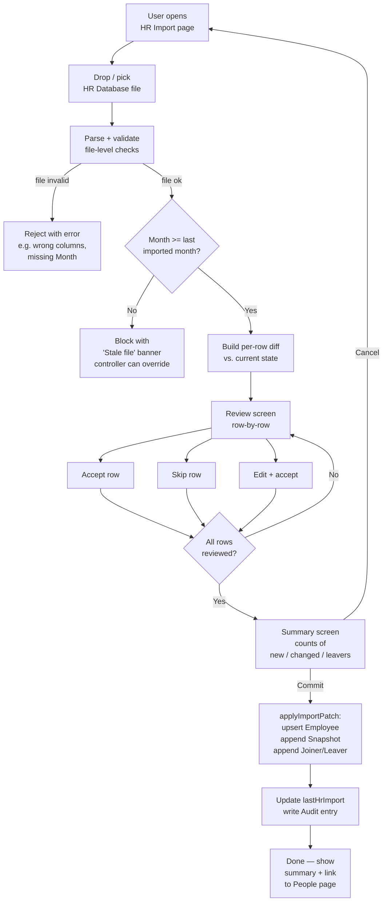

# HR Database Import

## 1. Purpose

Allow an authorised user to upload the monthly **HR Database Excel** (a flat
people register exported from the corporate HR system) into PracticeView,
**review every record before it is committed**, and keep the application's
employee master synchronised with the latest HR snapshot — without ever
overwriting newer data with an older file.

This document is the source of truth for the import workflow. It is intended
to be **edited by the business**: confirm or correct the field mapping in
section 8, the validation rules in section 9, and the open questions in
section 14, then hand it back to engineering for implementation.

## 2. Scope

| In scope | Out of scope |
| --- | --- |
| Parsing the HR Database `.xlsx` / `.xlsm` file | Live API integration with HR system |
| Per-employee review (accept / skip / correct) | Editing forecast values during the import |
| Month-level staleness check (no rollback) | Bulk delete of employees absent from the file |
| Mapping HR fields onto the application's `Employee` model | Payroll / salary data |
| Audit trail of who imported what, when | Re-running the legacy `CCA_PracticeView (N).xlsm` ingest path |

This flow is **separate** from the existing `Ingestion` page that consumes
the full `CCA_PracticeView (N).xlsm` workbook. Both flows can coexist; this
one targets the lightweight HR-only file.

## 3. Stakeholders & Roles

| Role | Permission on this flow |
| --- | --- |
| `controller` | Upload, review, commit, override staleness guard |
| `hr` | Upload, review, commit (cannot override staleness) |
| `pu_lead` | Read-only — can see what was last imported and when |
| `finance`, `viewer` | Read-only |

Permission is enforced in `useAppStore.canImportHr(role)`; UI hides the
"Upload" button for read-only roles.

## 4. Business Goals

1. Keep the people roster current with **at most 1-month lag** behind HR.
2. Make every change **auditable**: who imported, when, what changed.
3. Prevent silent data loss caused by an analyst opening last month's file
   and re-uploading it on top of this month's data.
4. Give the reviewer **per-row visibility** of what is changing, so a
   surprise (e.g., 30 unexpected leavers) is caught before commit.

## 5. Source: the HR Database file

- Format: `.xlsx` (single sheet, ~50 columns, ~1500 rows).
- Each row = one employee for one **reporting month** (`Month` column).
- Unique key in the file: **`Employee Number`** (column also appears as
  `Employee_Number` at the far right — they must be identical; mismatch is
  a validation error, see §9).
- The `Month` column states the snapshot the file represents (e.g.
  `2026-04`). One file = one month = one row per employee.

## 6. Target: the application data model

| Application object | Cardinality | Lifetime |
| --- | --- | --- |
| `Employee` ([src/types.ts:77](src/types.ts:77)) | one row per `localNumber` | persistent master |
| `EmployeeMonthSnapshot` ([src/types.ts:97](src/types.ts:97)) | one row per `(localNumber, period)` | append-only history |
| `Joiner` ([src/types.ts:191](src/types.ts:191)) | one row per joiner event | append-only |
| `Leaver` ([src/types.ts:205](src/types.ts:205)) | one row per leaver event | append-only |
| `lastHrImport` (NEW, store ephemeral) | one record | last successful import metadata |

**`Employee.localNumber` = HR `Employee Number`** is the unique identifier
across the entire application. Section 8 defines how each HR column lands.

## 7. Flow

### 7.1 High-level diagram



### 7.2 Step-by-step

1. **Open** the *HR Import* page (new route: `/ingest/hr`).
2. **Upload** an `.xlsx` file (drop zone + file picker).
3. **File validation** runs synchronously before any review:
   - Required columns present (see §8).
   - `Month` column is parseable and identical for every row.
   - `Employee Number` is non-empty for every row and unique within the file.
   - File is not empty.
   On failure: a red banner lists the problems; no state is touched.
4. **Staleness check**: if `fileMonth < lastHrImport.month`, block the
   upload with the message *"This file is from {fileMonth}; you have already
   imported data for {lastMonth}. Importing would overwrite newer data."*
   A controller can click **Override** (audited reason required); HR role
   cannot.
5. **Diff calculation**: for each file row, compute the change kind:
   | Diff kind | Condition |
   | --- | --- |
   | `new-employee` | `Employee Number` not in `state.employees` |
   | `unchanged` | Employee exists; all mapped fields equal |
   | `changed` | Employee exists; at least one mapped field differs |
   | `terminating` | `Date of termination` falls within `Month` (new this file) |
   | `re-hire` | Employee has `endDate` in past and `Hired YES/NO = YES` again |
   Plus: `missing-from-file` for every employee who exists in the store
   with no termination but is not present in the file (flagged for review,
   never auto-deleted).
6. **Review screen** (see §10) lets the user walk through every row and
   accept / skip / correct.
7. **Summary screen** shows counts and the diff one more time before commit.
8. **Commit** calls `applyImportPatch({ employees, snapshots, joiners,
   leavers })` and updates `lastHrImport`. A single `AuditEntry` is written
   describing the import (file name, month, counts, reviewer, timestamp).
9. **Done** — user is shown a green confirmation and a link to the People
   page filtered to the just-imported month.

### 7.3 What gets written to the store on commit

- `state.employees` — upsert by `localNumber`. New rows appended; existing
  rows replaced with merged values (file wins where a column maps; locally
  set fields like `capabilities[]`, `germanSpeaker`, `clearanceLevel` are
  preserved because they are not in the HR file).
- `state.snapshots` — one new `EmployeeMonthSnapshot` appended per row, for
  the file's `Month`. If a snapshot for that `(localNumber, period)`
  already exists it is replaced.
- `state.joiners` — append a `Joiner` for each row where
  `Joiner? = YES` AND no joiner exists for that employee in the same month.
- `state.leavers` — append a `Leaver` for each row where
  `Leaver = YES` AND `Date of termination` falls within the file month.
- `state.lastHrImport = { month, fileName, importedAt, importedBy,
  counts }`.
- `state.audit` — append one entry summarising the import.

Forecast cells, cycles, comments, and scenarios are **never touched**.

## 8. Field mapping (Excel → Application)

This is the **mapping the business must validate**. Each row says: how does
the HR column land in the application's data model? Edit the *Target* and
*Notes* columns and hand the file back if anything is wrong.

| # | HR column | Type | Target field | Direction | Notes |
| --- | --- | --- | --- | --- | --- |
| 1 | `Month` | `YYYY-MM` | `EmployeeMonthSnapshot.period` AND staleness key | required | One value for the whole file. Drives the staleness guard. |
| 2 | `Employee Number` | string | `Employee.localNumber` | required, **PK** | Unique identifier across the whole application. |
| 3 | `Employee_Number` (duplicate at far right) | string | — | validation only | Must equal column 2; otherwise reject the row. |
| 4 | `Last Name` | string | `Employee.lastName` | required | |
| 5 | `First Name` | string | `Employee.firstName` | required | |
| 6 | `Name` | string | `Employee.displayName` (fallback) | optional | If missing, derive as `firstName + " " + lastName`. |
| 7 | `Hired YES/NO` | enum YES/NO | derives `Joiner` event | required | YES creates a `Joiner` for the file's month if not already present. |
| 8 | `Joiner?` | enum YES/NO | derives `Joiner` event | optional | OR-ed with column 7. Discrepancy → warning. |
| 9 | `Leaver` | enum YES/NO | derives `Leaver` event | required | Combined with column 13 (`Date of termination`). |
| 10 | `Location` | string | `Employee.locationCode` | required | Resolved via `inferLocCode()` (Wrocław → WRO, etc.). Unknown → warning. |
| 11 | `Date of employment` | date | `Employee.startDate` | required | First-ever start date (not re-hire date). |
| 12 | `Date of termination` | date | `Employee.endDate` | optional | Empty for active employees. |
| 13 | `Date of the end contract` | date | NEW: `Employee.contractEndDate` | optional | Differs from `Date of termination` for fixed-term contracts. **Open Q1.** |
| 14 | `Date of release` | date | NEW: `Employee.releaseDate` | optional | Last working day; can differ from `endDate`. **Open Q1.** |
| 15 | `The method of contract termination` | string | NEW: `Leaver.terminationMethod` | optional | E.g. "Resignation", "Mutual agreement". |
| 16 | `Report generation date` | date | `lastHrImport.reportGeneratedAt` | optional | Sanity check: must be ≥ `Month`. |
| 17 | `Organization Name` | string | NEW: `Employee.org1Name` | optional | Top of org hierarchy. |
| 18 | `Number of Organization` | string | NEW: `Employee.org1Code` | optional | |
| 19 | `Organization Name2` | string | NEW: `Employee.org2Name` | optional | Second org level. |
| 20 | `Number of Organization3` | string | NEW: `Employee.org3Code` | optional | Third level / cost-centre. |
| 21 | `Production Unit` | string | `Employee.puCode` | required | Resolved via `inferPuCode()` against `ProductionUnit.shortName` / `displayName`. Unknown PU → warning, row goes to review queue. |
| 22 | `People Unit` | string | validation only | optional | Should match `Production Unit`. Mismatch → warning. **Open Q2.** |
| 23 | `Practice` | string | NEW: `Employee.practice` | optional | E.g. "C&CA". |
| 24 | `SBU` | string | derived from PU | validation only | Compared with `ProductionUnit.sbu`; mismatch → warning. |
| 25 | `P&L` | string | NEW: `Employee.pnlUnit` | optional | |
| 26 | `Qualification` | string | NEW: `Employee.qualification` | optional | E.g. "Master", "Bachelor". |
| 27 | `Job type` | string | derives `Employee.jobFunction` | required | Map: "CSS"→CSS, "EEC"→EEC, else `Z`. |
| 28 | `Job name zgodnie z modelem` | string | NEW: `Employee.jobNameModel` | optional | Capgemini global job name. |
| 29 | `Grade` | string | `Employee.gradeCode` | required | Validate against `state.grades[].code`; unknown → warning. |
| 30 | `Position (Polish)` | string | NEW: `Employee.positionPl` | optional | |
| 31 | `Position (English)` | string | NEW: `Employee.positionEn` | optional | Used in displayName tooltips. |
| 32 | `Contract manager` | string | NEW: `Employee.contractManagerName` | optional | |
| 33 | `Contract manager's number` | string | NEW: `Employee.contractManagerLocalNumber` | optional | FK to another `Employee.localNumber`; warning if not found. |
| 34 | `Contract manager's email` | email | NEW: `Employee.contractManagerEmail` | optional | |
| 35 | `Direct supervisor` | string | NEW: `Employee.directSupervisorName` | optional | |
| 36 | `Direct supervisor's number` | string | NEW: `Employee.directSupervisorLocalNumber` | optional | FK to `Employee.localNumber`; warning if not found. |
| 37 | `Direct supervisor's email` | email | NEW: `Employee.directSupervisorEmail` | optional | |
| 38 | `e-mail` | email | NEW: `Employee.email` | optional | Primary contact email. |
| 39 | `Sex` | enum M/F/Other | NEW: `Employee.sex` | optional | **Open Q3** (PII / GDPR — confirm we want to store this). |
| 40 | `File number` | string | NEW: `Employee.hrFileNumber` | optional | HR system internal reference. |
| 41 | `Separations` | string | NEW: `Employee.separationsFlag` | optional | **Open Q4** — what are the allowed values? |
| 42 | `Part time` | number/% | derives `Employee.fteCapacity` | required | "100%" or `1.0` → `1.0`; "80%" or `0.8` → `0.8`. |
| 43 | `Work experience (month \| day)` | string | NEW: `Employee.workExperience` | optional | Stored verbatim; presented as months in UI. |
| 44 | `Aktualny typ pracownika` | string | NEW: `Employee.currentEmployeeType` | optional | E.g. "Full-time employee", "Contractor". Drives whether `Grade` is allowed to be NG/Z. |

**Legend**
- *required*: row is rejected if missing.
- *NEW*: field does not yet exist on `Employee`; needs a model extension.
  All NEW fields should be added as **optional** so existing data is
  unaffected.
- *FK*: foreign key — link integrity is checked but not enforced (warning,
  not error).

## 9. Validation rules

### 9.1 File-level (block the whole upload)

| Code | Rule | Severity |
| --- | --- | --- |
| F01 | File parses as `.xlsx` / `.xlsm` | error |
| F02 | All required columns from §8 are present | error |
| F03 | `Month` is identical and parseable for every row | error |
| F04 | At least one data row | error |
| F05 | `Employee Number` is non-empty for every row | error |
| F06 | `Employee Number` values are unique within the file | error |
| F07 | `Employee Number == Employee_Number` per row | error |
| F08 | `fileMonth >= lastHrImport.month` (staleness guard) | error, controller-overridable |

### 9.2 Row-level (route the row to review with a flag)

| Code | Rule | Severity |
| --- | --- | --- |
| R01 | `Production Unit` resolves to a known PU | warning |
| R02 | `Grade` is in `state.grades[].code` | warning |
| R03 | `Location` resolves to a known location code | warning |
| R04 | `Date of termination` (when present) ≥ `Date of employment` | warning |
| R05 | `Joiner?` consistent with `Hired YES/NO` | warning |
| R06 | `Leaver = YES` ⇒ `Date of termination` is non-empty | error (row rejected) |
| R07 | `People Unit == Production Unit` | warning |
| R08 | `SBU` matches the resolved PU's SBU | warning |
| R09 | `Direct supervisor's number` exists in the file or in `state.employees` | warning |
| R10 | `Contract manager's number` exists in the file or in `state.employees` | warning |
| R11 | `Part time` ∈ (0, 1] | error |

### 9.3 Cross-row sanity (informational, shown on the summary screen)

| Code | Check |
| --- | --- |
| S01 | Net headcount delta vs. previous month (joiners − leavers − missing) |
| S02 | New PUs introduced by this file |
| S03 | Employees missing from the file but still active in the store |
| S04 | More than 5% of employees changed PU since last month (org reshuffle?) |

## 10. Per-employee review screen

A single-page review walker, not a giant table — the user said *"check
employee by employee and review each record"*.

```
┌────────────────────────────────────────────────────────────────────┐
│  HR Import — Reviewing 1432 records (file: 2026-04, KOWALSKA J.)   │
│  ─────────────────────────────────────────────────────────────────  │
│  [██████████████░░░░░░░░░░░░] 612 / 1432 reviewed                  │
│                                                                    │
│  Diff: CHANGED                                                     │
│  Employee Number: P0028743   Date of employment: 2018-09-03        │
│  Name: Kowalska, Jadwiga                                           │
│                                                                    │
│  Field            Current value         File value      Action      │
│  ──────────────   ───────────────────   ─────────────   ──────────  │
│  Production Unit  PL01NC04 (CCA_SE2)    PL01NC05        [Accept]    │
│  Grade            B2                    C1              [Accept]    │
│  Location         WRO                   POZ             [Accept]    │
│  Direct sup.      Nowak (P0011223)      Wójcik (P004)   [Accept]    │
│                                                                    │
│  Warnings: R01 PU resolved by inference                            │
│                                                                    │
│  [ Skip ]  [ Edit & Accept ]  [ Accept all ]   ← prev | next →     │
└────────────────────────────────────────────────────────────────────┘
```

UI rules:

- **Default sort**: errors first, then warnings, then `changed`, then
  `new-employee`, then `unchanged` (latter usually filtered out).
- **Filter chips**: `errors only` / `changed only` / `new only` / `all`.
- **Bulk actions**: *Accept all unchanged*, *Accept all warnings*. Errors
  cannot be bulk-accepted.
- **Skip**: row is excluded from this commit (audit logs it). The store is
  not modified for that employee. They will resurface next month.
- **Edit & Accept**: lets the reviewer overwrite the file value before it
  lands (e.g. correct an obviously wrong PU). The audit entry records both
  the file value and the saved value.
- **Keyboard**: `J` next, `K` prev, `A` accept, `S` skip, `E` edit. Lifted
  from the rest of the app's review patterns.

## 11. Admin mapping — Organization Unit & People Unit

The HR file uses the corporate taxonomy (raw codes and Polish-labelled
names). PracticeView uses **nice names** that the business already knows
and trusts (`CCA_SE2`, `CCA_Developers1`, `Cloud Practice`). We must keep
those nice names. The bridge is a **manually curated mapping**, owned by
the controller, lived under **Admin → HR Mapping**.

### 11.1 What is mapped

Two independent, complementary mappings:

#### A. Production Unit mapping

| Source (HR file) | Target (`ProductionUnit.code`) | Comment |
| --- | --- | --- |
| `Production Unit` value (column 21) | one of `state.productionUnits[].code` | e.g. `"CCA Software Engineers 2"` → `PL01NC04` |
| `Number of Organization` (column 18) | optional secondary key | e.g. `"PL01NC04"` → `PL01NC04` |
| `Organization Name` (column 17) | optional tie-breaker | only used when the PU column is empty |

The mapping replaces the heuristic `inferPuCode()` in
[src/lib/excelParser.ts:87](src/lib/excelParser.ts:87). Heuristics stay
as a fallback when no admin mapping exists for a value, and a warning is
raised so the controller can promote the fallback to an explicit row.

#### B. People Unit mapping

`People Unit` (column 22) is the HR-side label that **should** equal the
PU but in practice can drift (HR uses informal names, mergers happen).
Mapping it explicitly means we can:

- accept rows whose `People Unit` value is unknown to PracticeView,
- show a warning when `People Unit` resolves to a different PU than
  `Production Unit` does,
- preserve the nice display name even if HR renames their internal
  taxonomy.

| Source (HR file) | Target | Comment |
| --- | --- | --- |
| `People Unit` value | one of `state.productionUnits[].code` | many People-Unit values may map to one PU |

#### C. Optional: Location & Grade mappings

Same idea, lower priority. The free-text `Location` column already has
heuristic resolution (`inferLocCode`); `Grade` is usually clean. Both are
candidates for the same admin table — list them as **Q8** in §17 to
confirm before building.

### 11.2 Data model

New persistent slices in the store (see §18 for the full data-model
delta):

```ts
HrMappingEntry {
  id: string;                       // stable id
  kind: "production_unit"
      | "people_unit"
      | "location"                  // future
      | "grade";                    // future
  source: string;                   // the raw value from HR file (case-insensitive match)
  targetCode: string;               // PU code, location code, etc.
  note?: string;                    // why this mapping exists
  createdAt: string;
  createdBy: string;
  active: boolean;
}
```

Lookup function `resolveHrMapping(kind, sourceValue)` is case- and
whitespace-insensitive. Multiple identical `(kind, source)` rows are
prevented by store validation.

### 11.3 Admin UI

New tab in [src/pages/Admin.tsx](src/pages/Admin.tsx): **HR Mapping**.
Two side-by-side tables (`Production Unit`, `People Unit`):

```
┌─────────────────────────────────────────────────────────────────────┐
│ HR Mapping — Production Unit                                        │
│ ─────────────────────────────────────────────────────────────────── │
│  Source value (HR)                Mapped to (App)               •   │
│  ─────────────────────────────    ──────────────────────────────────│
│  CCA Software Engineers 2         PL01NC04 — CCA_SE2          [✏][✕]│
│  CCA Software Engineers 3         PL01NC05 — CCA_SE3          [✏][✕]│
│  CCA Cloud                        PL01NC08 — CCA_Cloud        [✏][✕]│
│  PL01NC04                         PL01NC04 — CCA_SE2          [✏][✕]│
│  …                                                                  │
│  [ + Add mapping ]                                                  │
│                                                                     │
│  Unmapped values seen in last import:                               │
│   • "CCA SE 2 (Wrocław)"   [Map…]                                   │
│   • "CCA Developers 1 / Crew A"   [Map…]                            │
└─────────────────────────────────────────────────────────────────────┘
```

UI rules:

- The **Mapped to** column is a searchable dropdown over the canonical
  list (`state.productionUnits` filtered to `active = true`,
  `isVirtual = false`). Display label = `"{code} — {shortName}"`. Nice
  name preserved.
- The **Unmapped values seen in last import** box reads from the most
  recent import's warnings (R01) and gives a one-click *Map* shortcut.
  This is what makes the mapping ergonomic over time.
- Inline `Add mapping` form: free-text source, dropdown target.
- Edit row: change target, add note. Delete row: confirmation prompt; if
  deleted, the heuristic fallback resumes for that source value.
- Permission: only `controller` can add / edit / delete mappings.

### 11.4 How import uses the mapping

```mermaid
flowchart LR
    HR[Row from HR file<br/>'Production Unit' = "CCA Software Engineers 2"] --> M{HrMappingEntry exists?}
    M -- yes --> T[Use mapped<br/>PU code PL01NC04]
    M -- no  --> H[Fallback: inferPuCode]
    H --> W[Warning R01:<br/>'unmapped PU value']
    W --> R[Surfaced in<br/>Admin → Unmapped values<br/>and review walker]
```

A row whose PU resolves only via heuristic is **not** rejected; it's
flagged for the reviewer and listed in Admin so the controller can
formalise it later. Once mapped, subsequent imports use the explicit
mapping.

### 11.5 Seeding

On first run, the store seeds the obvious 1:1 entries: each PU's
`code`, `shortName`, and `displayName` map to itself. That gives the
controller a starting point that already covers ~80% of well-formed
files.

## 12. Staleness guard — detail

The store keeps `lastHrImport.month`. On every new upload:

```
if (fileMonth < lastHrImport.month):  block (F08)
if (fileMonth == lastHrImport.month): allow, treated as "re-import" with
                                      diff against previous import for
                                      the same month
if (fileMonth > lastHrImport.month):  allow (normal forward import)
```

The block is hard for `hr` role. `controller` can override by typing a
reason; the override is recorded in the audit entry as
`hrImportStalenessOverride: <reason>`.

## 13. Post-import results screen

Shown immediately after the user clicks **Commit** on the review walker.
Replaces the lightweight green banner. The user said: *"after import I
need to see [the] difference screen"* — this is it. The screen is also
**permanently linkable** (`/ingest/hr/results/{importId}`) so the
controller can revisit it later from Admin → HR Imports.

### 13.1 Layout

```
┌────────────────────────────────────────────────────────────────────────┐
│ HR Import — Results                                                    │
│ File: HR_Database_2026_04.xlsx · Month: 2026-04 · Imported by: J. Nowak │
│ At: 2026-04-29 11:42 CET · Duration: 3.1s                              │
│ ──────────────────────────────────────────────────────────────────────  │
│                                                                        │
│  ┌── File ───────────────┐ ┌── People ────────────┐ ┌── Events ─────┐  │
│  │ Rows read         1432│ │ Total people    1432 │ │ Joiners    12 │  │
│  │ Rows skipped         3│ │ New              12  │ │ Leavers     8 │  │
│  │ Rows rejected        0│ │ Changed          47  │ │ Re-hires    1 │  │
│  │ Warnings            14│ │ Unchanged      1373  │ │ Transfers  17 │  │
│  └───────────────────────┘ │ Missing-from-file 6  │ └───────────────┘  │
│                            └──────────────────────┘                    │
│                                                                        │
│  Tabs: [ Changed (47) ] [ New (12) ] [ Joiners (12) ] [ Leavers (8) ]  │
│        [ Skipped (3) ] [ Missing (6) ] [ Warnings (14) ]               │
└────────────────────────────────────────────────────────────────────────┘
```

### 13.2 Tab content

#### Changed (47)

A table — one row per person, expandable to show field-level deltas.

| Employee | PU before | PU after | Fields changed | Reviewer |
| --- | --- | --- | --- | --- |
| P0028743 — Kowalska, J. | PL01NC04 | PL01NC05 | PU, Grade, Location | accepted |
| P0019112 — Adamski, T. | PL01NC03 | PL01NC03 | Direct supervisor | edited |
| … | | | | |

Click a row → drawer with full before/after for every mapped field, plus
the warnings that fired on it.

#### New (12)

A table — one row per new employee, with the columns most relevant to
onboarding (`Employee Number`, `Name`, `PU`, `Grade`, `Location`,
`Date of employment`, `Job type`).

#### Joiners (12)

The new `Joiner` events created by this import. Required by the user
("how many joiners was mark with list of that joiners"). One row per
joiner, columns: `Start date`, `Employee Number`, `Name`, `PU`, `Grade`,
`Location`, `Source: HR import` (vs. `manual`).

#### Leavers (8)

Mirror of Joiners. Columns: `End date`, `Employee Number`, `Name`, `PU`,
`Grade`, `Method of contract termination`, `Source: HR import`.

#### Skipped (3)

Rows the reviewer chose **Skip** on. Reason captured during review (if
any). These persons were **not** modified in the store.

#### Missing-from-file (6)

Persons present in `state.employees` (active, no `endDate`) who do not
appear in the file at all. Common reasons: just-onboarded (HR not synced),
on long leave, accidentally dropped from the export. **No** automatic
action — the controller can mark them as leavers manually from this list.

#### Warnings (14)

The aggregated list of all R-level warnings, grouped by code (R01..R10
from §9.2), with the count and the option to drill into the affected
rows.

### 13.3 Export

A `Download as Excel` button on the results screen produces a workbook
with one sheet per tab. Useful for circulating the change list to PU
leads after every monthly import.

## 14. Per-person change history

Required by the user: *"In people screen for each record I need to see
also history of change for that person — what was changed by import but
also what was changed by user in application."*

A new card on [src/pages/PersonDetail.tsx](src/pages/PersonDetail.tsx),
**Change history**, sits below "PU transfer history" and above
"ARVE trend".

### 14.1 Sources of change

| Source | Where it comes from | Already exists in code? |
| --- | --- | --- |
| HR import | `audit` entries with `entityType = "employee"`, `action = "update"` and `kind = "hr_import"` (NEW kind on AuditEntry) | partial — `AuditEntry` exists but no employee-update entries are written today |
| User edit in app | New audit entries for `addEmployee`, `transferEmployee`, `setEmployeeCapabilities`, `setEmployeeGermanSpeaker`, `setEmployeeClearanceLevel` | partial — these mutations are not currently audited |
| Joiner / Leaver creation | `joiners[]` / `leavers[]` records (already exist) | yes |
| PU transfer | `transfers[]` (already exists, already shown) | yes |

To get a complete history we have to start writing audit entries for
**every employee mutation** — both import-driven and user-driven. See
§18.4 for the audit-coverage delta.

### 14.2 Layout

```
┌──────────────────────────────────────────────────────────────────────┐
│ Change history — KOWALSKA, Jadwiga (P0028743)                        │
│ ──────────────────────────────────────────────────────────────────── │
│ Filter: [ All ] [ Imports only ] [ User edits only ]                 │
│                                                                      │
│ 2026-04-29 11:42  · HR import (2026-04) · J. Nowak                   │
│   PU                : PL01NC04 → PL01NC05                            │
│   Grade             : B2 → C1                                        │
│   Direct supervisor : P0011223 → P0044556                            │
│   Location          : WRO → POZ                                      │
│                                                                      │
│ 2026-04-12 09:13  · User edit  · M. Wójcik                           │
│   Capabilities      : ["Java"] → ["Java","Kafka","K8s"]              │
│                                                                      │
│ 2026-03-30 17:02  · HR import (2026-03) · J. Nowak                   │
│   First name        : "Jadwiga" → "Jadwiga" (no change, file)        │
│   Direct supervisor : (empty) → P0011223                             │
│                                                                      │
│ 2026-03-15 10:08  · PU transfer · M. Wójcik                          │
│   PU                : PL01NC03 → PL01NC04   (effective 2026-04)      │
│                                                                      │
│ 2025-09-03 08:00  · Joiner · system                                  │
│   Start date 2025-09-03 · PU PL01NC03 · Grade B2                     │
└──────────────────────────────────────────────────────────────────────┘
```

UI rules:

- Reverse-chronological. Pagination at 25 entries.
- Each entry shows: timestamp, source kind, actor, then a list of
  `field: before → after` lines. Imports show the import month next to
  the kind so you can correlate with the results screen.
- The source kind is colour-coded (subtle): import = brand colour, user
  edit = neutral, transfer = info, joiner/leaver = green/red.
- Filter chip toggles which sources are visible.
- Click an *Import* entry → opens the post-import results screen
  (§13) for that import, scrolled to this person.
- Empty state when no history exists: "No tracked changes yet" rather
  than hiding the card.

### 14.3 Performance note

The per-person history is derived by filtering `state.audit` by
`(entityType = "employee", entityId = localNumber)` plus the joiner /
leaver / transfer lookups. For 1500 employees over 24 months this is
small (a few thousand audit rows total) — no indexing required.

## 15. Audit & compliance

Every committed import writes one `AuditEntry` ([src/types.ts:276](src/types.ts:276)) with:

- `kind: "hr_import"`
- `actor: { name, email, role }` (from `state.user`)
- `at: ISO timestamp`
- `summary: "HR import — 2026-04 — 1432 rows (12 new, 8 leavers, 47 changed, 3 skipped)"`
- `details: { fileName, fileMonth, counts: { new, changed, unchanged,
  leavers, skipped, missing }, warnings: number, stalenessOverride?:
  string }`

Per-row decisions are stored in a separate `audit.hrImportRows[]` table
keyed by `(importedAt, localNumber)` for traceability. **Open Q5**: do we
need to retain row-level audit forever, or can we keep only the last 12
imports?

## 16. Edge cases

| Case | Handling |
| --- | --- |
| Employee in store but missing from file | Flag as `missing-from-file` on summary screen. Do **not** auto-terminate. Reviewer can mark them as leavers manually. |
| Employee with `endDate` in past appears again as `Hired YES/NO = YES` | Diff kind = `re-hire`. New start date overwrites; `endDate` cleared; new `Joiner` event written. |
| Two rows in file share the same `Employee Number` | F06 — file rejected. |
| `Month` is in the future | Allowed, but a yellow banner: *"This file is dated {fileMonth}; today is {currentPeriod()}. Continue?"* |
| File contains employees from a PU not in `state.productionUnits` | R01 warning per row. Reviewer can map them to an existing PU before commit. |
| Browser tab crashes mid-review | The review session is stored in `sessionStorage` keyed by file hash; reopening the page within 24h restores progress. |
| Same file uploaded twice in a row | After the second upload, the diff screen shows zero changes. No commit needed; banner: *"Already up to date."* |

## 17. Open questions for the business

1. **Q1 — Termination dates.** Excel has three "end" dates: `Date of
   termination`, `Date of the end contract`, `Date of release`. Which one
   drives the `Leaver` event and `Employee.endDate`? Default proposal:
   `Date of termination`.
2. **Q2 — Production Unit vs People Unit.** Are they always identical, or
   can they legitimately differ? If they can differ, which one drives FTE
   roll-up?
3. **Q3 — `Sex` column.** Do we want to persist this? GDPR-relevant; if
   yes, should it be visible in PracticeView UI or only stored?
4. **Q4 — `Separations` column.** What are the allowed values? Free text
   or enum?
5. **Q5 — Row-level audit retention.** Forever, 12 months, or 24 months?
6. **Q6 — Retroactive corrections.** If HR corrects last month's data and
   re-issues a file with an earlier `Month`, do we want a separate
   "correction" path that side-steps the staleness guard with mandatory
   sign-off?
7. **Q7 — `currentEmployeeType` taxonomy.** What is the closed set of
   values, and does any of them need to influence `jobFunction` or
   `gradeCode` assignment?
8. **Q8 — Mapping scope.** Should the Admin mapping (§11) cover
   `Location` and `Grade` from day one, or only `Production Unit` and
   `People Unit`? Lower priority but cheap to include.
9. **Q9 — Results screen retention.** How long should
   per-import results pages remain accessible from Admin? Default
   proposal: 24 months, then archive to JSON in `lastImports[].archived`.

## 18. Application changes required

This section is the engineering shopping list — what code has to change
to deliver §1–§17. Grouped by file. Items already covered by partial
infrastructure are marked *extend*; everything else is *new*.

### 18.1 Routes and pages

| Route | Page | Status |
| --- | --- | --- |
| `/ingest/hr` | `src/pages/HrImport.tsx` | new — upload + review walker (§7, §10) |
| `/ingest/hr/results/:importId` | `src/pages/HrImportResults.tsx` | new — results screen (§13) |
| `/admin` (HR Mapping tab) | extend `src/pages/Admin.tsx` | extend — add tab + sub-tables (§11) |
| `/people/:localNumber` (Change history card) | extend `src/pages/PersonDetail.tsx` | extend — new card (§14) |

Routing wiring: add the two new routes in `src/App.tsx` (router config)
and a sidebar item *HR Import* (visible to `controller`, `hr`).

### 18.2 Type model (`src/types.ts`)

**Extended `Employee`** — every field is optional so existing data
typechecks unchanged:

```ts
export interface Employee {
  // existing
  localNumber: string;
  ggid?: string;
  firstName: string;
  lastName: string;
  displayName: string;
  puCode: string;
  gradeCode: string;
  jobFunction: JobFunction;
  locationCode: string;
  startDate: string;
  endDate?: string | null;
  fteCapacity: number;
  engagement: string;
  skills: string[];
  capabilities?: string[];
  germanSpeaker?: boolean;
  clearanceLevel?: ClearanceLevel;

  // NEW from HR file (all optional)
  email?: string;
  sex?: "M" | "F" | "Other";
  hrFileNumber?: string;
  contractEndDate?: string | null;
  releaseDate?: string | null;
  practice?: string;
  pnlUnit?: string;
  qualification?: string;
  jobNameModel?: string;
  positionPl?: string;
  positionEn?: string;
  contractManagerName?: string;
  contractManagerLocalNumber?: string;
  contractManagerEmail?: string;
  directSupervisorName?: string;
  directSupervisorLocalNumber?: string;
  directSupervisorEmail?: string;
  workExperience?: string;
  currentEmployeeType?: string;
  separationsFlag?: string;
  org1Name?: string;
  org1Code?: string;
  org2Name?: string;
  org3Code?: string;
}
```

**New types:**

```ts
export interface HrMappingEntry {
  id: string;
  kind: "production_unit" | "people_unit" | "location" | "grade";
  source: string;             // raw value from HR file (case-insensitive match)
  targetCode: string;         // PU/location/grade code in app
  note?: string;
  createdAt: string;
  createdBy: string;
  active: boolean;
}

export interface HrImport {
  id: string;
  fileName: string;
  fileMonth: Period;          // YYYY-MM
  reportGeneratedAt?: string;
  importedAt: string;
  importedBy: string;
  durationMs: number;
  counts: {
    rowsRead: number;
    rowsSkipped: number;
    rowsRejected: number;
    warnings: number;
    new: number;
    changed: number;
    unchanged: number;
    leavers: number;
    joiners: number;
    rehires: number;
    transfers: number;
    missingFromFile: number;
  };
  warnings: HrImportWarning[];
  rowDecisions: HrImportRowDecision[];
  stalenessOverrideReason?: string;
}

export interface HrImportWarning {
  code: "R01" | "R02" | "R03" | "R04" | "R05" | "R07" | "R08" | "R09" | "R10";
  localNumber: string;
  message: string;
}

export interface HrImportRowDecision {
  importId: string;
  localNumber: string;
  diffKind: "new-employee" | "changed" | "unchanged" | "re-hire"
          | "terminating" | "missing-from-file" | "skipped";
  fieldDiffs: Array<{ field: string; before: unknown; after: unknown }>;
  decidedBy: string;
  decidedAt: string;
  action: "accept" | "edit-accept" | "skip";
  edits?: Record<string, unknown>;
}
```

**Extended `AuditEntry`** — add `kind` for the import path so the
PersonDetail change-history card can pick HR-import entries cleanly:

```ts
export interface AuditEntry {
  // existing
  id: string; actor: string; entityType: string; entityId: string;
  action: /* … existing literals … */;
  before?: unknown; after?: unknown; ts: string; requestId?: string;
  // NEW
  kind?: "hr_import" | "user_edit" | "transfer" | "joiner" | "leaver"
       | "capability_change" | "mapping_change";
  importId?: string;          // back-reference to HrImport.id when kind = "hr_import"
}
```

### 18.3 Store (`src/store.ts`)

**New persistent slices:**

```ts
hrMappings: HrMappingEntry[];     // §11
hrImports: HrImport[];            // §13 results history
lastHrImport?: { id: string; month: Period; importedAt: string; importedBy: string };
```

**New actions:**

```ts
addHrMapping(entry: Omit<HrMappingEntry, "id" | "createdAt" | "createdBy" | "active">): void;
updateHrMapping(id: string, patch: Partial<HrMappingEntry>): void;
removeHrMapping(id: string): void;
resolveHrMapping(kind: HrMappingEntry["kind"], source: string): string | undefined;

dryRunHrImport(file: File): Promise<HrImportPreview>;     // parses + diff, no writes
commitHrImport(preview: HrImportPreview,
               decisions: HrImportRowDecision[],
               opts?: { stalenessOverrideReason?: string }): HrImport;

canImportHr(role: Role): boolean;                          // §3 permission
canOverrideStaleness(role: Role): boolean;                 // controller only
```

**Persistence key:**

`commitHrImport` mutates `employees`, `snapshots`, `joiners`, `leavers`,
`audit`, `hrImports`, `lastHrImport` — all already in the persisted
slice list. The `localStorage` key (`cca-practiceview-v2`, see
[CLAUDE.md](CLAUDE.md)) **must bump** to `cca-practiceview-v3` because
`Employee` schema changes.

A migration in the `persist` middleware handles old states by adding
empty `hrMappings: []` and `hrImports: []` and leaving employees
untouched.

### 18.4 Audit coverage (impacts §14 directly)

Today the store mutates employee state without writing audit entries.
For the per-person change history to be useful we must add audit writes
to:

| Action | File | Audit `kind` | Notes |
| --- | --- | --- | --- |
| `addEmployee` | `src/store.ts` | `user_edit` | action `create` |
| `transferEmployee` | `src/store.ts` | `transfer` | already produces a `Transfer` row; add a corresponding `AuditEntry` |
| `setEmployeeCapabilities` | `src/store.ts` | `capability_change` | before/after = capability ids array |
| `setEmployeeGermanSpeaker` | `src/store.ts` | `user_edit` | scalar |
| `setEmployeeClearanceLevel` | `src/store.ts` | `user_edit` | scalar |
| `addJoiner` | `src/store.ts` | `joiner` | action `create` |
| `addLeaver` | `src/store.ts` | `leaver` | action `create` |
| `addHrMapping` / `updateHrMapping` / `removeHrMapping` | `src/store.ts` | `mapping_change` | for the mapping table itself |
| `commitHrImport` | `src/store.ts` | `hr_import` | one umbrella entry per import (§15), plus one per-employee `hr_import` audit row for every changed person, with `importId` back-reference |

This is the **only** way to satisfy *"history of change … by import but
also by user"* — without these audit writes the change-history card
will be permanently empty.

### 18.5 Parser (`src/lib/excelParser.ts` → split)

The current parser is monolithic: it expects the full
`CCA_PracticeView (N).xlsm`. Refactor:

- Move HR-row parsing into a new `src/lib/hrDbParser.ts`. It accepts a
  flat HR Database file (§5) and returns `{ rows, fileMonth, warnings }`.
  All §8 columns read here. PU resolution flows through
  `resolveHrMapping("production_unit", ...)` first, then
  `inferPuCode()` as fallback.
- Keep `excelParser.ts` for the existing legacy workbook path. Both can
  share `asPeriod`, `asDate`, `str`, `num`, `inferPuCode`,
  `inferLocCode` via a small `parseUtils.ts`.
- Add `src/lib/hrImportDiff.ts` that takes `(parsedRows, currentState)`
  and returns the diff classification (§7.2 step 5).

### 18.6 New components

| Component | Path | Purpose |
| --- | --- | --- |
| `HrImportDropZone` | `src/components/hr-import/HrImportDropZone.tsx` | upload zone + file-level validation banner |
| `HrImportReviewWalker` | `src/components/hr-import/HrImportReviewWalker.tsx` | per-employee step-through (§10) |
| `HrImportResults` | `src/components/hr-import/HrImportResults.tsx` | summary screen (§13) |
| `HrMappingEditor` | `src/components/admin/HrMappingEditor.tsx` | Admin tab (§11) |
| `EmployeeChangeHistory` | `src/components/people/EmployeeChangeHistory.tsx` | PersonDetail card (§14) |

### 18.7 Tests to add

- `src/lib/hrDbParser.test.ts` — happy path + each row-level rule R01..R11.
- `src/lib/hrImportDiff.test.ts` — classification of every diff kind.
- `src/store.hr-import.test.ts` — staleness guard (F08), commit writes,
  audit fan-out, schema migration from v2 → v3.
- `src/store.hr-mapping.test.ts` — add/update/remove, case-insensitive
  resolution, fallback to `inferPuCode`.
- Component test for the review walker (keyboard shortcuts).

### 18.8 Knowledge write-back (per CLAUDE.md rule)

Editing `src/types.ts`, `src/store.ts`, or
`src/lib/forecast.ts` requires updating the matching note in
`.claude/knowledge/`. Files to touch:

- `.claude/knowledge/architecture/store-shape.md` — document new slices
  `hrMappings`, `hrImports`, `lastHrImport`.
- `.claude/knowledge/architecture/excel-parser.md` — note the split into
  `hrDbParser.ts` and that PU resolution now goes through admin mapping
  first.
- `.claude/knowledge/playbooks/` — new playbook
  `hr-database-import.md` summarising the operator-facing flow (link
  back to this spec).

### 18.9 Out-of-scope confirmations (no code change)

- Forecast cells, cycles, scenarios, comments, working calendar — **not
  touched** by HR import.
- Lock/archive logic for cycles — unrelated.
- The legacy `Ingestion` page continues to work for the full workbook
  flow.

## 19. Acceptance criteria

The feature is considered complete when:

- [ ] User with `hr` or `controller` role can upload an HR Database file
      and walk every row through the review screen.
- [ ] Uploading a file with `Month < lastHrImport.month` is blocked for
      `hr`, overridable for `controller` with a recorded reason.
- [ ] Each committed import yields exactly one umbrella `AuditEntry`
      (`kind: "hr_import"`) plus one per-employee audit row per changed
      person, both back-referenced to the same `HrImport.id`.
- [ ] After commit, the People page reflects the new employees, changed
      fields, and new joiner/leaver events.
- [ ] The post-import results screen shows the counts panel
      (rows read, skipped, rejected, warnings, new, changed, unchanged,
      missing) and the seven tabs (Changed, New, Joiners, Leavers,
      Skipped, Missing, Warnings) with the lists described in §13.
- [ ] The results screen is reachable later from Admin → HR Imports via
      a stable URL `/ingest/hr/results/{importId}`.
- [ ] Admin → HR Mapping lets a controller manage Production Unit and
      People Unit mappings, surfaces unmapped values from the last
      import, and seeds with PU `code` / `shortName` / `displayName`.
- [ ] Nice names (`PU.shortName`, `PU.displayName`) remain authoritative
      in every screen; HR raw values appear only in the mapping editor
      and import diagnostics.
- [ ] PersonDetail shows a Change history card combining HR imports,
      user edits, transfers, and joiner/leaver events; entries link back
      to the relevant import results screen when applicable.
- [ ] Forecast cells, cycles, scenarios, and comments are unchanged across
      the import.
- [ ] All validation rules from §9 fire on a deliberately broken sample
      file and are surfaced in the UI.
- [ ] The review walker is keyboard-navigable.
- [ ] All new fields added to `Employee` are optional; pre-existing demo
      data still typechecks and renders.
- [ ] LocalStorage migration v2 → v3 runs cleanly on existing user state
      (no data loss, empty `hrMappings` and `hrImports` arrays added).

## 20. Glossary

- **HR Database** — the standalone monthly Excel export from the corporate
  HR system. Distinct from the operational `CCA_PracticeView (N).xlsm`.
- **Snapshot month** — the value of the `Month` column; it represents the
  state of the world at the **end** of that month.
- **Staleness guard** — the rule that prevents importing a file whose
  `Month` is earlier than the last committed import.
- **Diff kind** — the per-row classification (`new-employee`, `changed`,
  `unchanged`, `re-hire`, `terminating`).
- **Review walker** — the per-employee step-through UI in §10.
